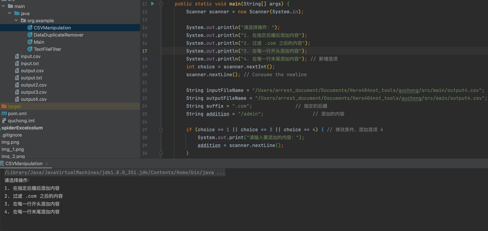
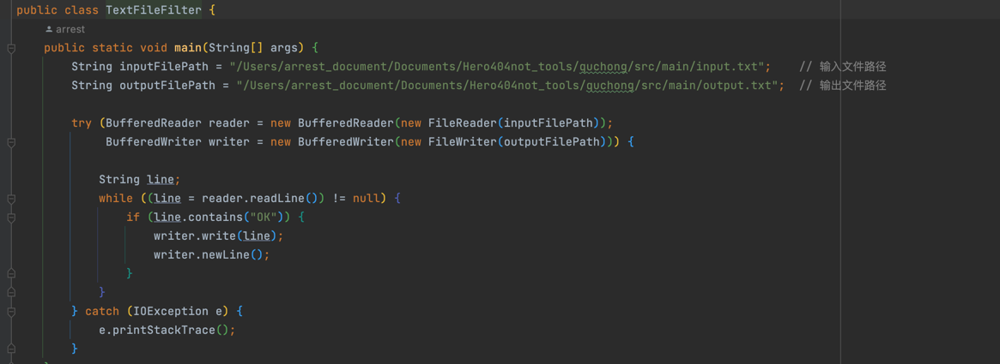

# Hero404not_tools
工具大合集

1，简单的压缩炸弹脚本，可以对服务器造成资源损耗，py脚本，可以通过下边很清楚的看到42kb解压完有5G，用于拿到Shell进行攻击的一种方式

2.Tomcat弱口令批量验证脚本，通过开启多个bash达到的多线程

3.对一些ssm项目或者java的项目，使用web.xml文件配置相关路由的进行路由提取。

**`python3 servlet_parse.py web.xml -o 1.txt`**

4.对于数据的处理，可以去除重复，添加指定后缀，删除指定后缀的批处理，用于信息收集之后的信息整理，

5.一些简单的java安全使用技巧和一些基于反序列化的远程RCE的学习。

使用本软件只用于合法学习和交流，不允许非法活动，尊重他人隐私，避免发布虚假信息，尊重不同观点，不滥用功能，遵守法律，积极参与，如发现问题请报告。
